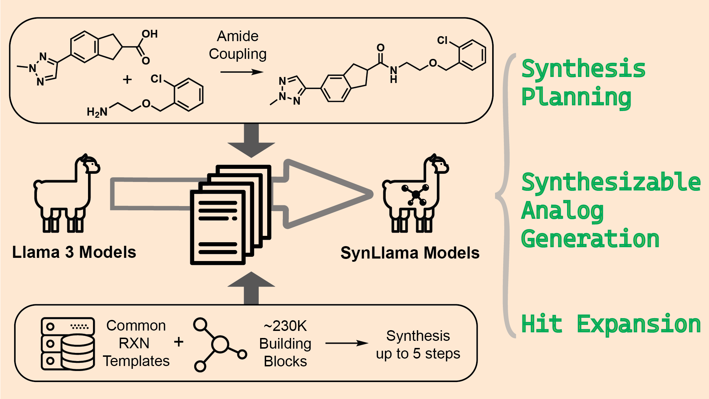

# SynLlama: Generating Synthesizable Molecules and Their Analogs with Large Language Models 🧬
[](LICENSE)
[](https://arxiv.org/abs/2503.12602)

## 📖 Overview

SynLlama is a fine-tuned version of Meta's Llama3 large language models that generates synthesizable analogs of small molecules by creating full synthetic pathways using commonly accessible building blocks and robust organic reaction templates, offering a valuable tool for drug discovery with strong performance in bottom-up synthesis, synthesizable analog generation, and hit expansion.

## 💡 Usage

### Prerequisites
Ensure you have `conda` installed on your system. All additional dependencies will be managed via the `environment.yml` file.

### Installation
To get started with SynLlama, follow these steps:
```bash
git clone https://github.com/THGLab/SynLlama
cd SynLlama
conda env create -f environment.yml
conda activate synllama
pip install -e .
```

### Inference
To perform inference using the already trained SynLlama, download the trained models and relevant files from [here](https://figshare.com/s/39a37d31cea2c190498d) and follow the instructions in the [Inference Guide](assets/docs/inference_guide.md).

### Retraining
If you are interested in retraining the model, please refer to the [Retraining Guide](assets/docs/retraining_guide.md) for detailed instructions.

## 📄 License
This project is licensed under the MIT License - see the [LICENSE](LICENSE) file for details

## 📝 Citation
If you use this code in your research, please cite:

```bibtex
@misc{sun_synllama_2025,
    title = {SynLlama: Generating Synthesizable Molecules and Their Analogs with Large Language Models},  
    url = {http://arxiv.org/abs/2503.12602},
    doi = {10.48550/arXiv.2503.12602},
    publisher = {arXiv},
    author = {Sun, Kunyang and Bagni, Dorian and Cavanagh, Joseph M. and Wang, Yingze and Sawyer, Jacob M. and Gritsevskiy, Andrew and Head-Gordon, Teresa},
    month = mar,
    year = {2025}
}
```